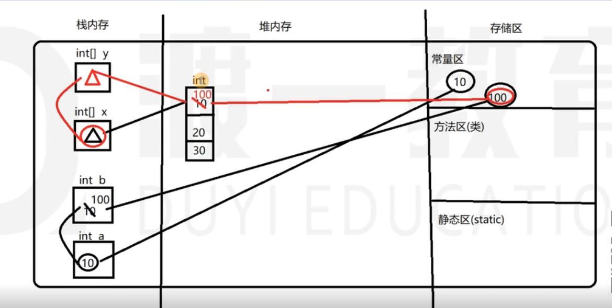

# 11.数组

### 数组

* 数组本身是一个引用数据类型
* 数组不同于变量，变量空间只能存放一个数据。数组可以存放一组（数据类型相同的数据）。
* 长度给定后不能更改

### 数组的定义（声明）

* 数据类型\[\] 数组名;

```text
int[] x;
char[] x;
bollean[] x;
String[] x;
```

###  数组的赋值（初始化，引用类型叫初始化）

* 静态初始化 \(所有引用数据类型的初始化都用new\)
* 有长度，有元素

```text
int[] array = new int[]{1,2,3,4,5};
int[] array = {1,2,3,4,5}  
// 这种静态赋值，可以看到长度，内容。
```

* 动态初始化
* 只有长度，没有元素，只有默认值。
  * int  0
  * folat 0.0
  * double 0.0
  * char  0 对应的unicode
  * bollean false
  * 引用数据类型 null

```text
int[] array = new int[5];
```


### 数组元素的访问

* 通过元素再数组中的索引index
* 存取都可以

```text
array[index]
array[0]
array[999]
// 如果超程，可以通过编译，但会导致运行时异常。
ArrayIndexOutOfBoundsException
```

### 数组的遍历

* 普通for循环。可以存值，也可以取值。因为有index索引出现。

```text
arraylist.length
for(int i = 0; i<5; i++) {

}
```

* JKD1.5之后出现的增强for循环。可以取值，不能存值。因为没有index索引
* 只有用于取值的变量，和数组。没有index不能存值

```text
for(用于接收的变量名 : 需要循环的数组){   
}
for(int value : array) {
}
// 第二个括号里的int不要丢掉
```

### 基本数据类型和引用数据类型在内存的区别

```text
int a = 10;
int b = a;
b = 100;
int a ???

int[] x = new int[]{1,2,3,4,5};
int[] y = x;
y[0] = 100;
x[0]????
```

* 所有new 都是在堆内存开辟空间
* 栈内存存的是数组第一个元素的地址（hashcode）
* 上例在堆内存中只有一个对象
* 基本数据类型存的是值
* 引用数据类型存的是地址




作业2

* 一
  * 创建一个5行的2维数组
  * 第一行元素为3个，4个。。。。7个
  * 利用for循环和for each循环遍历数组
* 二
  * 利用while循环遍历以上2维数组，使得每行最后两个元素不遍历

```text
package test;

public class Test1 {

	public static void main(String[] args) {
		int[][] a= {{0,1,2},{0,1,2,3},{0,1,2,3,4},{0,1,2,3,4,5},{0,1,2,3,4,5,6}};
		
		for(int i=0;i<a.length;i++) {
			for(int j=0;j<a[i].length;j++) {
				System.out.print(a[i][j]);
			}
			System.out.println();
		}
	
		for(int[] unit:a) {
			for(int item:unit) {
				System.out.print(item);
			}
			System.out.println();
		}
			
		int x = 0;
		while(x<a.length) {
			int y = 0;
			while(y<a[x].length-2) {
				System.out.print(a[x][y]);
				y++;
			}
			System.out.println();
			x++;
		}
		
		
	}

}

```

* 运行下列程序并说明原因

1.

```text
public class Person {
	int age=18;
	Person(int age){
		this.age=age;
	}
	Person(){	
	}

}

public class Entrance {

	public static void main(String[] args) {
		Person[] p = new Person[3];
		p[0]=new Person();
		p[1]=p[0];
		System.out.println(p[2].age);

	}

}

```

2.

```text
public class Entrance {

	public static void main(String[] args) {
		int[] p=new int[3];
		System.out.println(p[1]);
	}

}

```

3.

```text
public class Entrance {

	public static void main(String[] args) {
		int[] a= new int[3];
		int[] b= a;
		a[0] = 20;
		System.out.println(a[0]);
		System.out.println(b[0]);		
	}
}

```

答案都是20.

4.

```text
public class Entrance {

	public static void main(String[] args) {
		int[] a= new int[3];
		int[] b= new int[3];
		b[0] = a[0];
		a[0] = 20;		
		System.out.println(a[0]);
		System.out.println(b[0]);	
	}
}

```

20  0

5.

```text
public class Person {
	int age=18;
	Person(int age){
		this.age=age;
	}
	Person(){	
	}

}


public class Entrance {

	public static void main(String[] args) {
		Person[] a = new Person[3];
		Person[] b = a;
		a[0] = new Person();
		b[0] = new Person(22);
		System.out.print(a[0].age);
		System.out.print(b[0].age);
		
	}

}
```

答案都是22

6.

```text
public class Person {
	int age=18;
	Person(int age){
		this.age=age;
	}
	Person(){	
	}

}


public class Entrance {

	public static void main(String[] args) {
		Person[] a = new Person[3];
		Person[] b = new Person[3];
		b[0] = new Person(22);
		b[0] = a[0];
		a[0] = new Person();
		
		
		System.out.print(a[0].age);
		System.out.print(b[0].age);
		
	}

}
```

空指针报错。

